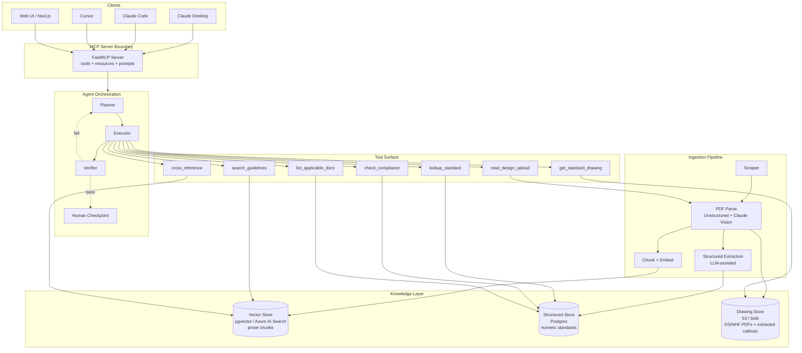
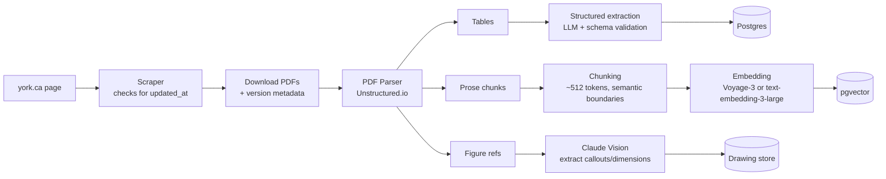
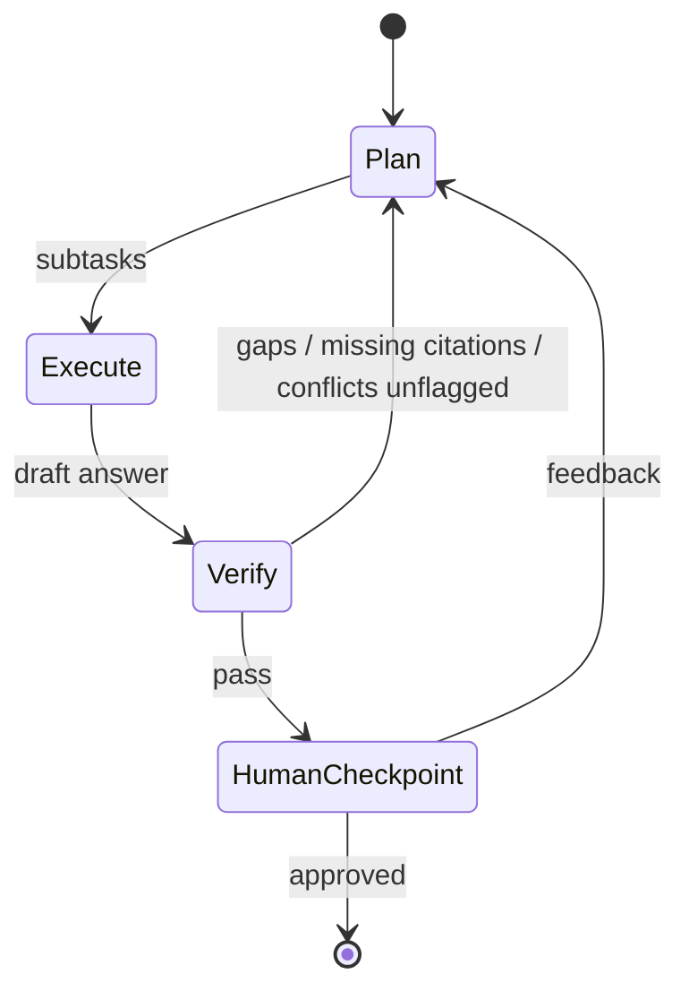

# Urban Planning Agent — Architecture & Design

> **Status:** v0.1 design draft
> **Scope:** Road design assistance, regulation checking, and standards compliance for York Region engineering work
> **Audience:** Engineers (consultants designing, reviewers checking submissions, juniors learning)

---

## 1. Overview

This document describes a citation-first agentic system that helps engineers (1) look up the right York Region road-design standard for a given context, (2) review a proposed design against those standards, and (3) propose preliminary cross-sections and design parameters that can be hand-finalized by a PEO-sealed designer.

### Core principle: citation-first retrieval is the foundation, agency sits on top

Engineering work is unforgiving. The first time the agent confidently states *"minimum travel-lane width is 3.3m"* without a section/page citation to the Road Design Guidelines (Dec 2025), the reviewing engineer loses trust permanently. Therefore the architecture's North Star is **every claim carries a verifiable citation**. The agentic planning/decomposition/verification loop is layered on top — it never replaces the citation contract.

### What "agentic" means here

The agent decomposes a design or review task into sub-questions, routes each to the right tool (semantic search, structured lookup, drawing retrieval, compliance check), and runs a verifier pass that confirms every claim is sourced and every applicable guideline was consulted before output is finalized. A human checkpoint gates any "propose" or "review verdict" output.

---

## 2. Goals and Non-Goals

### Goals

- Answer standards questions with verifiable citations (document, section, page).
- Cross-reference overlapping guidelines automatically. Designing an Avenue cross-section pulls from DGS *and* Pedestrian/Cycling *and* Street Tree *and* DS-100 intersection drawings — these often disagree at the margins, and the agent's job is to surface that.
- Run compliance checks against a structured design payload (uploaded or hand-entered).
- Propose preliminary design parameters (cross-section widths, sight distances, taper rates) consistent with chosen road type and context.
- Expose all of the above as an MCP server so it works inside Claude Desktop, Cursor, Claude Code, and any other MCP client.

### Non-Goals (v1)

- Replacing PEO-sealed final drawings. Output is marked *"for reference; final designs require sealed engineering review."*
- Other municipalities. Architecture is extensible to Toronto, Peel, Durham later; v1 is York Region only.
- Generating final-quality CAD/DWG drawings. Output is textual + parameter tables + drawing references.
- Site plan or planning-approval workflow. This is engineering design only.
- Real-time collaboration / multi-user editing.

---

## 3. Users and Personas

| Persona | Primary task | Tolerance for uncertainty |
|---|---|---|
| **Consultant engineer** | Designing a road for development submission | Low — needs cite-able answers |
| **Review engineer** (Region or peer-review consultant) | Checking a submitted design against standards | Very low — verdict drives approval |
| **Junior engineer** | Learning which standards apply when | Higher — exploratory questions |

The same agent serves all three. The differentiator is the *prompt template* and the *verifier strictness*, not the core architecture.

---

## 4. Domain Scope (Corpus)

Documents from `york.ca/business/economic-and-development-services/land-development/construction-design-guidelines-and`, grouped by functional area:

### 4.1 Geometric and road design
- **Designing Great Streets (DGS) Guidelines Parts 1-2** — six road types (City Centre Street, Avenue, Main Street, Connector, Rural Road, Rural Hamlet Road); context-sensitive design framework
- **Road Design Guidelines (Dec 2025)** + Storm Sewer Design Sheet (Appendix A) + Revision Log
- **Access Guidelines for Regional Roads (2020)** — driveway, intersection access spacing
- **Transportation Mobility Plan Guidelines (2025)**

### 4.2 Active transportation
- **Pedestrian and Cycling Planning and Design Guidelines (2020) Parts 1-3**
- **Sustainable Mobility Wayfinding Guidelines (2018)**

### 4.3 Streetscape, trees, and landscaping
- **Street Tree and Horticultural Design Guidelines (Jan 2022)**
- **Street Tree and Forest Preservation Guidelines (May 2025)**
- **Acceptable Tree Species (May 2025)** and **Acceptable Shrub and Perennial Species (Jan 2022)** — structured species lists
- **NHF-100/200/400/500 series standard drawings**
- **Irrigation Design Guidelines (April 2024)**

### 4.4 Standard drawings (the DS series)
- **DS-100 Intersection Design** (Oct 2025)
- **DS-200 Commercial and Residential Entrance** (Oct 2025)
- **DS-300 Illumination** (Jan 2023)
- **DS-400 Pavement Marking** (Jan 2023)
- **Electrical Standard Drawings** (Oct 2025)
- **Streetscape Standard Drawings** (Oct 2025)
- **Regulated Planting / Utility Locations**
- **YRT Concrete Bus Pad and Bus Bay** (Mar 2026)

### 4.5 Specifications and bid form templates (Word docs)
Lower priority for the design-assistance phase, higher for tendering workflows. Defer to v2.

### 4.6 Master plans (contextual reference)
- **South Yonge Street Corridor Streetscape Master Plan** (Phases 1-6)
- **Yonge Street and Davis Drive Streetscape Master Plan** (Phases 1-5)

### 4.7 FTP-gated content (defer)
- **Transportation CAD Standards** (TRN_CAD, behind FTP login)
- **NHF CAD Standards** (behind form request)
- **Water/Wastewater Consultant Resources** (behind FTP login)

**v1 MVP corpus:** sections 4.1, 4.2, 4.3, 4.4. This covers ~95% of road-design lookups.

---

## 5. System Architecture



### Why two knowledge stores

Hard numeric standards (lane widths, sight distances, taper rates, design speeds) belong in a relational store with strict schemas, not in a vector index. Retrieval on *"minimum stopping sight distance for 60 km/h on a Connector"* through embedding similarity is fragile; a SQL lookup against a typed table is deterministic and auditable. Prose context, design philosophy, and qualitative guidance live in the vector store where semantic search shines.

The agent decides which store to query based on the question type. The verifier checks that numeric claims came from the structured store, not from prose retrieval (which would suggest the LLM is paraphrasing a number — a red flag).

---

## 6. Data Layer

### 6.1 Ingestion pipeline



**Stage notes:**

- **Scraper** runs on a schedule (weekly) and diffs against last-seen `meta-article:modified_time`. New version → ingest, tag with version_date, keep prior version queryable for historical compliance checks.
- **PDF parsing** is the highest-risk step. The DGS PDFs are table-heavy; the DS-series drawings are technical figures. Prototype with **Unstructured.io** for prose+tables and **Claude Vision** for figure callouts. Budget real time for parsing-quality iteration; it determines everything downstream.
- **Structured extraction** uses an LLM with a strict JSON schema to pull numeric standards out of tables. Each row is validated and rejected if it doesn't match the schema. Rejections go to a human-review queue.
- **Chunking** uses semantic boundaries (section headings, paragraph breaks) rather than fixed-size sliding windows. Each chunk carries `doc_id`, `section`, `page`, `version_date` metadata.

### 6.2 Vector store schema

```sql
CREATE TABLE guideline_chunks (
  id            UUID PRIMARY KEY,
  doc_id        TEXT NOT NULL,
  doc_title     TEXT NOT NULL,
  version_date  DATE NOT NULL,
  section       TEXT,
  page          INT,
  road_types    TEXT[],        -- ['avenue', 'main_street'] for filtering
  topics        TEXT[],        -- ['cross_section', 'sight_distance', 'cycling']
  chunk_text    TEXT NOT NULL,
  embedding     VECTOR(1024),  -- Voyage-3 dim
  is_latest     BOOLEAN DEFAULT TRUE
);

CREATE INDEX ON guideline_chunks USING hnsw (embedding vector_cosine_ops);
CREATE INDEX ON guideline_chunks USING gin (road_types);
CREATE INDEX ON guideline_chunks USING gin (topics);
```

Hybrid retrieval: dense (cosine) + BM25 over `chunk_text`, with metadata filters on `road_types`, `topics`, and `is_latest`.

### 6.3 Structured store schema (illustrative subset)

```sql
CREATE TABLE road_type (
  id          SERIAL PRIMARY KEY,
  name        TEXT UNIQUE NOT NULL,    -- 'avenue', 'connector', etc.
  description TEXT,
  source_doc  TEXT NOT NULL,           -- 'DGS Part 1'
  source_section TEXT,
  source_page INT,
  version_date DATE NOT NULL
);

CREATE TABLE cross_section_standard (
  id              SERIAL PRIMARY KEY,
  road_type_id    INT REFERENCES road_type(id),
  element         TEXT NOT NULL,        -- 'travel_lane', 'cycle_track', 'sidewalk'
  position        TEXT,                 -- 'curbside', 'median', etc.
  min_value_m     NUMERIC,
  typical_value_m NUMERIC,
  max_value_m     NUMERIC,
  conditions      JSONB,                -- {"speed_kmh": 60, "context": "urban"}
  source_doc      TEXT NOT NULL,
  source_section  TEXT,
  source_page     INT,
  version_date    DATE NOT NULL
);

CREATE TABLE geometric_standard (
  id           SERIAL PRIMARY KEY,
  road_type_id INT REFERENCES road_type(id),
  parameter    TEXT NOT NULL,           -- 'stopping_sight_distance'
  value        NUMERIC NOT NULL,
  unit         TEXT NOT NULL,
  conditions   JSONB,
  source_doc   TEXT NOT NULL,
  source_section TEXT,
  source_page  INT,
  version_date DATE NOT NULL
);

CREATE TABLE standard_drawing (
  id          SERIAL PRIMARY KEY,
  series      TEXT NOT NULL,             -- 'DS-100', 'NHF-200'
  drawing_no  TEXT NOT NULL,
  title       TEXT NOT NULL,
  file_uri    TEXT NOT NULL,
  applies_to  TEXT[],                    -- road types, contexts
  version_date DATE NOT NULL,
  UNIQUE (series, drawing_no, version_date)
);
```

**Citation contract:** every row in every standards table carries `source_doc`, `source_section`, `source_page`, and `version_date`. Tools return these unmodified to the caller.

### 6.4 Versioning

Documents update — Road Design Guidelines was last revised Dec 2025, the DS-100 series was updated Oct 2025. Each row is tagged with `version_date`. Default queries hit `is_latest = TRUE`; engineers can pin a version for compliance checks against historical submissions.

---

## 7. Tool Surface

The agent operates through a fixed set of tools. Each tool has a clear contract, returns citations, and is independently testable.

```python
from dataclasses import dataclass
from typing import Literal

@dataclass
class Citation:
    doc_id: str
    doc_title: str
    section: str | None
    page: int | None
    version_date: str

@dataclass
class StandardValue:
    parameter: str
    value: float
    unit: str
    conditions: dict
    citation: Citation

@dataclass
class Chunk:
    text: str
    citation: Citation
    relevance: float

# --- tools ---

def search_guidelines(
    query: str,
    road_type: str | None = None,
    topics: list[str] | None = None,
    top_k: int = 8,
) -> list[Chunk]:
    """Hybrid semantic + BM25 search over prose guidelines. Returns chunks with citations."""

def lookup_standard(
    road_type: str,
    element: str,
    parameter: Literal["min", "typical", "max"] = "min",
    conditions: dict | None = None,
) -> StandardValue:
    """Deterministic SQL lookup against the structured store. Raises if no row matches."""

def get_standard_drawing(series: str, drawing_no: str) -> dict:
    """Returns drawing metadata + file URI + extracted callouts."""

def cross_reference(
    topic: str,
    road_type: str | None = None,
) -> list[dict]:
    """Returns all guideline sections across docs that address the topic.
    Used to detect cross-doc conflicts (e.g. DGS says X, Cycling Guidelines says Y)."""

def check_compliance(
    design: dict,             # parsed design payload
    scope: list[str],         # ['geometric', 'cross_section', 'sight_distance', ...]
) -> dict:
    """Runs rule checks against the design. Returns pass/fail per rule with citations."""

def read_design_upload(file_path: str) -> dict:
    """Parses an uploaded design PDF/CAD/JSON into a structured design payload."""

def list_applicable_documents(
    scope: str,                # 'avenue cross-section in mixed-use'
) -> list[dict]:
    """Returns the set of guideline docs the agent SHOULD consult for this scope.
    Used by the verifier to check coverage."""
```

**Why `list_applicable_documents` matters:** the verifier uses it to detect *missed* guidelines. If the agent answered an Avenue-cross-section question by consulting only the DGS, but this tool says the Pedestrian/Cycling Guidelines and Street Tree Guidelines also apply, the verifier sends the task back to the planner.

---

## 8. Agent Loop (LangGraph)



### 8.1 Planner node

**Input:** user request + conversation state
**Output:** ordered list of typed subtasks

The planner uses a Claude prompt with a few-shot template of road-design decompositions. Example:

> User: *"Design a cross-section for an Avenue with on-street parking in a mixed-use area."*
>
> Subtasks:
> 1. Identify applicable docs (call `list_applicable_documents`).
> 2. Look up Avenue road-type definition and target speed (call `search_guidelines` + `lookup_standard`).
> 3. Look up travel-lane width, parking-lane width, cycle-facility width per DGS for Avenue (structured lookups).
> 4. Look up boulevard / sidewalk width per Pedestrian/Cycling Guidelines.
> 5. Look up street-tree planting requirements per Street Tree Guidelines (boulevard width interactions).
> 6. Cross-reference: do any of the above conflict?
> 7. Compose draft cross-section with citations.

### 8.2 Executor node

Routes subtasks to tools. Where two subtasks are independent (e.g. cross-section lookup and street-tree lookup), run them in parallel. Where one depends on another (cross-reference depends on having all sources gathered), serialize.

### 8.3 Verifier / Critic node

Runs a fixed checklist on the draft:

- [ ] Every numeric claim has a `Citation` attached.
- [ ] Every citation resolves to a row in the structured store or a chunk in the vector store (no hallucinated section numbers).
- [ ] All docs returned by `list_applicable_documents` for the scope were consulted.
- [ ] Any conflicts surfaced by `cross_reference` are explicitly addressed in the draft (not silently ignored).
- [ ] Versioning is consistent (all citations use the same `version_date` unless a version comparison was requested).
- [ ] Output includes the standard "for reference; sealed engineering review required" disclaimer when in "propose" mode.

Fail → return to planner with structured feedback. Pass → human checkpoint.

### 8.4 Human checkpoint

Before any *propose* or *review verdict* output is finalized, the engineer is shown the draft with all citations linked. They can approve, request changes, or reject. In the MCP context, this is just the natural turn boundary — the engineer reads and decides what to do.

---

## 9. MCP Server Interface

Exposing the agent as MCP makes it usable from Claude Desktop, Cursor, Claude Code, and any other MCP-compatible client. This is the portfolio differentiator and also the most natural deployment shape for an internal engineering tool.

### 9.1 Tools (MCP-exposed subset)

A subset of the internal tool surface, with simpler signatures:

| MCP tool name | Backed by | Notes |
|---|---|---|
| `ask_standards` | full agent loop | High-level Q&A; runs plan/execute/verify |
| `lookup_value` | `lookup_standard` | Direct deterministic lookup |
| `find_drawing` | `get_standard_drawing` | Returns drawing reference + URI |
| `review_design` | `check_compliance` | Accepts design payload, returns compliance report |
| `list_docs_for` | `list_applicable_documents` | Discovery helper |

### 9.2 Resources

MCP resources expose the document corpus as URIs the client can fetch and embed in context:

- `york://docs/dgs/part-1`
- `york://docs/road-design-guidelines/2025-12`
- `york://drawings/ds-100/intersection-design`
- `york://standards/avenue/cross-section`

### 9.3 Prompts (pre-built workflows)

MCP prompts let users invoke common workflows with parameters:

- `design_cross_section(road_type, context, special_constraints)`
- `review_submitted_profile(file_path)`
- `compare_road_types(type_a, type_b)`
- `check_sight_distance(speed_kmh, road_type, conditions)`

### 9.4 Transport and auth

- **Local (stdio):** v1 default. Runs as a subprocess of Claude Desktop / Claude Code.
- **Remote (HTTP/SSE):** v2, for hosted multi-user deployment. Token-based auth.

---

## 10. Evaluation Strategy

Without measurement this project drifts. Evaluation is built in from Phase 1.

### 10.1 Golden set

50-100 hand-curated questions across the corpus, each with:
- The question text
- The expected numeric answer (or expected list of applicable guidelines)
- The expected citation(s)

Curate from the documents themselves (reverse-engineer from known tables). If access to a practicing engineer is possible, validate the set with them.

### 10.2 Metrics

| Metric | Definition | Target (v1) |
|---|---|---|
| **Citation existence** | % of factual claims with a Citation attached | 100% |
| **Citation correctness** | % of citations that resolve to a real, relevant source | ≥98% |
| **Numeric accuracy** | % of numeric answers within tolerance of golden | ≥95% |
| **Coverage** | % of applicable guidelines consulted (vs `list_applicable_documents`) | ≥90% |
| **Conflict surfacing** | Recall on a hand-built set of known cross-doc disagreements | ≥80% |
| **Latency p50** | Full agent loop, planner→verifier | <30s |

### 10.3 Harness

Pytest-based, runs in CI on every PR. A subset of the golden set runs on every commit; the full set runs nightly. Regressions block merge.

---

## 11. Phased Rollout

Each phase is independently demoable and provides standalone value.

### Phase 1 — Ingestion + RAG (1-2 weeks)
- Scrape and parse the top 4-5 PDFs (DGS Parts 1-2, Road Design Guidelines Dec 2025, Cycling Guidelines Parts 1-3)
- Chunk + embed into pgvector
- Single tool: `search_guidelines`, with strict citation
- CLI interface for testing
- Golden set of 20 questions
- **Acceptance:** ≥95% citation correctness on golden set

### Phase 2 — Structured standards extraction (1-2 weeks)
- LLM-assisted extraction of numeric tables into Postgres
- Add `lookup_standard`, `list_applicable_documents`
- Expand golden set to 50 questions
- **Acceptance:** ≥95% numeric accuracy on lookup questions

### Phase 3 — LangGraph agent loop (2-3 weeks)
- Planner / executor / verifier nodes
- `cross_reference` and conflict detection
- Full eval harness in CI
- **Acceptance:** ≥80% conflict surfacing recall; planner produces sensible decompositions on 10 evaluator-graded scenarios

### Phase 4 — Compliance checker (2 weeks)
- `read_design_upload` and `check_compliance`
- Rule library for the most common checks (lane widths, sight distances, intersection geometry)
- Compliance-report output format
- **Acceptance:** 10 synthetic submitted-design test cases pass with correct verdicts

### Phase 5 — MCP server + polish (1 week)
- FastMCP wrapper
- Tools, resources, and prompts exposed
- Claude Desktop integration tested
- Documentation
- **Acceptance:** End-to-end workflow runs from Claude Desktop without intervention

### Phase 6 (stretch) — UI and hosted deployment
- Next.js web UI for non-MCP-client users
- HTTP MCP transport with auth
- Hosted on Railway or Azure

---

## 12. Tech Stack

| Layer | Choice | Rationale |
|---|---|---|
| Language | Python 3.11+ | LangGraph, Unstructured, FastMCP all native |
| Agent orchestration | LangGraph | State machine fits planner/executor/verifier cleanly; you've already studied it |
| LLM (reasoning) | Claude Sonnet 4.5 | Long context for guidelines; strong tool use |
| LLM (routing/cheap calls) | Claude Haiku 4.5 | Classification, simple extraction |
| Vector store (v1) | pgvector | Single DB for both stores; no extra infra |
| Vector store (v2+) | Azure AI Search | Fills the resume gap you identified; better hybrid search at scale |
| Structured store | Postgres | Same instance as pgvector |
| PDF parsing | Unstructured.io + Claude Vision | Best balance of tables + figures |
| Embeddings | Voyage-3 (1024d) | Strong on technical content; or text-embedding-3-large as alternative |
| API | FastAPI | Standard choice; ties to your FastMCP/LangGraph work |
| MCP server | FastMCP | Pythonic, minimal boilerplate |
| Frontend (v2) | Next.js + Tailwind | Familiar from your existing work |
| Hosting (v1) | Railway / Fly.io | Cheap, fast deploys |
| Hosting (v2) | Azure (App Service + AI Search) | Enterprise narrative for resume |
| Eval | pytest + custom harness | Lightweight; no need for deepeval until scale |
| CI | GitHub Actions | Standard |

---

## 13. Risks and Open Questions

| Risk | Severity | Mitigation |
|---|---|---|
| PDF parsing quality on DS drawings is poor | High | Prototype parsing in week 1 on 5 representative drawings; if it fails, fall back to "drawing reference only, no callout extraction" for v1 |
| Standards updates not caught | Medium | Scheduled scraper diffs `meta-article:modified_time`; alerts on changes |
| Liability for design recommendations | High | All "propose" output carries explicit disclaimer; agent never recommends final values without engineer review checkpoint |
| Cross-doc conflicts the agent can't resolve | Medium | Verifier flags, surfaces to human; never resolves unilaterally |
| FTP-gated CAD standards inaccessible | Low | v1 doesn't need them; defer to v2 once FTP credentials acquired |
| LLM hallucinates citations | High | Verifier resolves every citation against the actual store; unresolvable citations fail the verifier |
| Cost of full-corpus reindex | Medium | Incremental ingestion by `version_date`; embeddings cached |
| Embedding model lock-in | Low | Abstract behind an interface; swap costs one reindex |

### Open questions for v0.2

1. Do we extract dimensional callouts from the DS drawings into the structured store, or keep them image-only? Affects whether the agent can answer "what does DS-100-04 say about left-turn lane taper?" without showing the drawing.
2. How do we represent "context-sensitive" guidance in the structured store? DGS is explicit that values vary by land use — do we have multiple rows per `(road_type, element)` keyed by context, or do we keep context as soft prose?
3. Versioning UX: when an older submission is reviewed against current standards, do we default to the standards version current at submission time, or current today?
4. Multi-tenancy: if other municipalities are added later, is the store partitioned by region or a single store with `region` as a column?

---

## 14. Repo Layout

```
urban-planner-agent/
├── README.md
├── docs/
│   ├── ARCHITECTURE.md          # this document
│   ├── EVAL.md                  # golden set, metrics methodology
│   └── adr/                     # architecture decision records
├── ingestion/
│   ├── scrape.py
│   ├── parse.py                 # Unstructured + Claude Vision
│   ├── extract_structured.py    # LLM-assisted table extraction
│   ├── chunk_embed.py
│   └── pipelines/               # one per doc type
├── store/
│   ├── schema.sql
│   ├── migrations/
│   └── repository.py            # data-access layer
├── tools/
│   ├── search.py
│   ├── lookup.py
│   ├── drawings.py
│   ├── cross_reference.py
│   ├── compliance.py
│   └── citations.py             # Citation dataclass, resolver
├── agent/
│   ├── planner.py
│   ├── executor.py
│   ├── verifier.py
│   ├── graph.py                 # LangGraph wiring
│   └── prompts/
├── mcp_server/
│   ├── server.py                # FastMCP entry
│   ├── tools.py
│   ├── resources.py
│   └── prompts.py
├── eval/
│   ├── golden_set.jsonl
│   ├── harness.py
│   └── metrics.py
├── api/                         # FastAPI, v2
├── tests/
└── pyproject.toml
```

---

## 15. Out of Scope (explicitly)

- Real-time CAD editing or generation
- Cost estimation / quantity takeoff (specs and bid forms are deferred to v2)
- Site plan or planning approvals
- Construction-phase issue tracking
- Other municipalities (architecturally ready; not in v1)

---

## Appendix A — Glossary

- **DGS** — Designing Great Streets, York Region's context-sensitive road-design framework
- **DS series** — York Region standard drawings (DS-100 intersections, DS-200 entrances, DS-300 illumination, DS-400 pavement marking)
- **NHF** — Natural Heritage and Forestry standard drawings (NHF-100/200 street trees, NHF-400 tree protection, NHF-500 irrigation)
- **PEO** — Professional Engineers Ontario; sealed drawings are PEO-licensed engineer signed
- **MCP** — Model Context Protocol; standard for exposing tools/resources/prompts to LLM clients
- **RAG** — Retrieval-Augmented Generation
- **PEO-sealed** — A drawing or report signed and stamped by a licensed engineer, required for legal submission

---

*End of v0.1 design draft. Open questions in §13 should be resolved before Phase 3 begins.*
