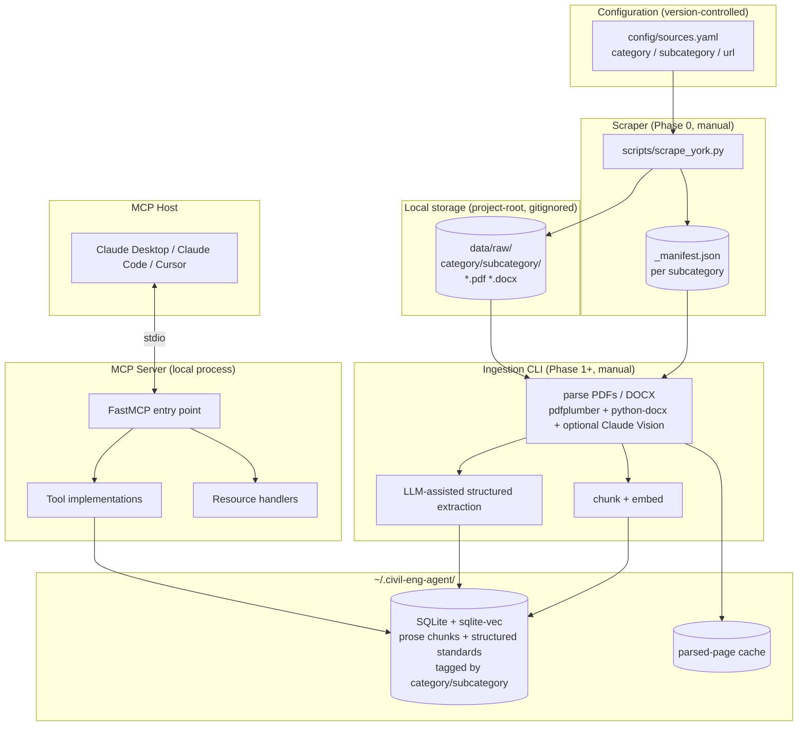
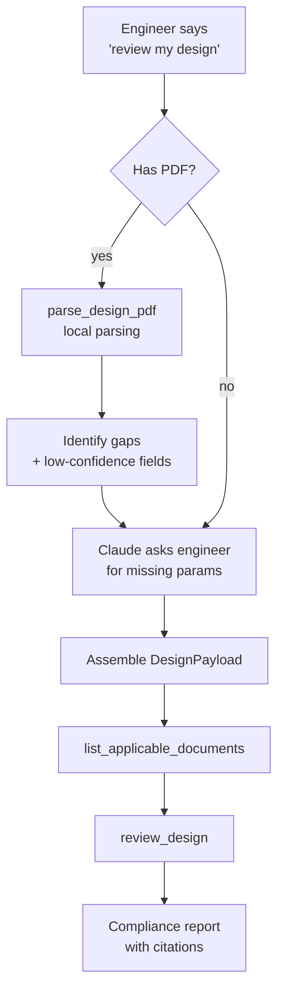

# Civil Engineering Design Assistant — MCP Server

> **Status:** v0.3 design draft
> **Scope:** Standards Q&A, parameter lookup, and PDF-or-interactive design review for York Region road design — extensible to other regions and document categories
> **Audience:** Civil engineers reviewing or proposing road designs in AutoCAD; the MCP runs locally next to the engineer's workflow
> **Replaces:** v0.2 (MCP-first scope, flat corpus)
> **Changes since v0.2:** Source corpus is now hierarchical and config-driven (`category → subcategory → URL`); DOCX added alongside PDF; scraper promoted to Phase 0; `category`/`subcategory` propagate through schema, tools, and MCP resources.

---

## 1. Overview

This is an **MCP server** that gives a civil engineer working in AutoCAD a knowledgeable co-pilot inside Claude Desktop, Claude Code, or Cursor. It does **not** drive AutoCAD. The engineer draws; the MCP answers standards questions, looks up design parameters, and runs compliance checks against York Region guidelines — all with verifiable citations and all running **locally** on the engineer's machine.

The corpus is sourced through a **declarative configuration** of `(category, subcategory, URL)` entries. The first source is `Land Development / Construction Design Guidelines and Standards` from York Region. New categories and subcategories can be added by editing one YAML file — no code changes required. This keeps the system honest about *where* its knowledge comes from and makes it straightforward to extend to other regions or document classes later.

### Why MCP-first

- **AutoCAD has no real MCP surface.** Driving CAD from an LLM would need a custom .NET plugin and brings drawing-corruption risk. Not worth it for v1.
- **The engineer is already in a conversation with Claude.** MCP slots into that natural workflow without requiring a new UI, login, or context-switch.
- **Local execution preserves data sensitivity.** Engineering drawings are confidential. Nothing uploaded, nothing hosted, no auth surface to defend.

### Core principle: citation-first retrieval

Every claim the MCP returns carries a citation to a specific document, section, and page. Numeric values come from a structured store with typed schemas; prose context comes from semantic search over chunked guidelines. Claims without resolvable citations fail at the tool layer — they never reach the engineer.

### What "review" means here

Two review modes, same compliance contract:

1. **Interactive review** — Claude (the host model) walks the engineer through parameters one at a time. Each answer is checked against standards via MCP tools. Output: a compliance report.
2. **PDF review** — Engineer points the MCP at a local PDF (plan, profile, or design brief). The MCP parses it locally, extracts whatever parameters it can identify, and asks the engineer to confirm or fill gaps. Output: the same compliance report.

DWG parsing is **out of scope**. PDF export from AutoCAD is a one-click operation every engineer already knows.

---

## 2. Goals and Non-Goals

### Goals

- Local-first MCP server: zero network calls beyond the LLM API the host client already uses
- **Config-driven, extensible source acquisition** — add a new category/subcategory/URL to a YAML file and re-run the scraper
- Standards Q&A with verifiable citations (doc, category, subcategory, section, page, version date)
- Deterministic numeric lookups for road-design parameters
- Standard-drawing references (DS-series, NHF-series)
- Compliance checking from either interactive Q&A or PDF input
- Works in Claude Desktop, Claude Code, and Cursor without modification

### Non-Goals (v1)

- Driving AutoCAD or generating DWG/CAD files
- Hosted multi-user deployment
- Authentication, multi-tenancy, audit logging
- Replacing PEO-sealed final review — all output carries an explicit disclaimer
- DWG parsing
- Recursive crawling — the scraper only visits configured URLs, not links discovered on them
- Final design generation — the MCP suggests parameter ranges; the engineer makes calls

---

## 3. Users

| User | Workflow |
|---|---|
| **Consultant designing** a road for development submission | Asks Claude for the right parameters as they draft in AutoCAD |
| **Review engineer** checking a submitted design | Exports the submission to PDF, points the MCP at it, gets a compliance report |
| **Junior engineer** learning the standards | Conversational Q&A, exploratory questions |

Same MCP server, same tools. The difference is which tools each user invokes most.

---

## 4. Corpus — Hierarchical, Config-Driven

### 4.1 Source model

The corpus is defined by a YAML config of source entries. Each entry has a `category`, `subcategory`, and `url` pointing to an index page that links to one or more documents (PDF or DOCX).

```yaml
# config/sources.yaml
sources:
  - category: Land Development
    subcategory: Construction Design Guidelines and Standards
    url: https://www.york.ca/business/economic-and-development-services/land-development/construction-design-guidelines-and

  # Future entries — add by editing this file and re-running the scraper.
  # - category: Land Development
  #   subcategory: Development Engineering Review
  #   url: https://www.york.ca/...
  #
  # - category: Transportation
  #   subcategory: Some Other Standard
  #   url: https://www.york.ca/...
```

The scraper visits each `url`, finds every document link under `york.ca/media/`, and downloads each one. PDFs and DOCX files are both supported (DOCX is needed because York Region distributes Roadworks Specifications, Bid Forms, and similar contract documents as Word files).

### 4.2 v1 starting source

Single entry:

| Category | Subcategory | URL |
|---|---|---|
| Land Development | Construction Design Guidelines and Standards | `york.ca/business/.../construction-design-guidelines-and` |

This single page links to ~30 documents that v0.2 enumerated by hand. Now the list is discovered automatically each time the scraper runs, so we pick up new additions and version updates without editing the architecture.

### 4.3 Extensibility

Adding a new source — whether a new subcategory under York Region, a new municipality (Toronto, Peel, Durham), or a different document class (e.g. Transit, Water/Wastewater) — is one YAML entry. Schema and tool surface absorb the new dimension automatically because `category` and `subcategory` are first-class metadata throughout (§6.2, §7).

What is **not** automatic: parsing quality and structured-extraction prompts may need per-category tuning. That's documented per-category in `ingestion/extractors/`.

### 4.4 Deferred

- **FTP-gated content** (Transportation CAD Standards, NHF CAD Standards, Water/Wastewater Consultant Resources). Behind logins; v1 doesn't require them.
- **Recursive crawling.** The scraper visits exactly the URLs in the config; it does not follow links to subpages. If a subpage holds documents you want, add it as its own entry.
- **External master plans** (South Yonge, Yonge & Davis). Available but lower priority for road-design Q&A.

---

## 5. System Architecture



### Three independent stages

| Stage | When it runs | Owns |
|---|---|---|
| **Scraper** (Phase 0) | Manually, when sources are added or remote docs change | `data/raw/`, `_manifest.json` |
| **Ingestion** (Phase 1+) | Manually, after scraping | `~/.civil-eng-agent/corpus.db` |
| **MCP Server** | Continuously, while the engineer works | Tool calls; reads from `corpus.db` |

These stages are intentionally decoupled. The scraper can run on its own and produce a useful corpus folder for human browsing. The ingestion can be re-run with new extraction prompts without re-downloading. The MCP server cares only about the DB.

### Why the split

- **Discovery vs. ingestion are different concerns.** Discovery is "what documents exist where on the web." Ingestion is "what structured knowledge can we extract from those documents." Mixing them makes both harder to test.
- **Idempotence and resumability.** The scraper can be killed and re-run; the manifest tells it what's already on disk. Same for ingestion.
- **Auditability.** Every doc in the DB traces back through ingestion to a file in `data/raw/` to a row in `_manifest.json` to a URL. Nothing comes from nowhere.

### Key architectural decisions

| Decision | Why |
|---|---|
| **YAML config, not a database** for sources | Version-controlled, editable in any IDE, diffable in PRs |
| **Scraper as standalone script**, not part of the server | Different lifecycle, different deps, runs maybe weekly vs. continuously |
| **Mirror category/subcategory on disk** | One look at `data/raw/` tells the engineer what's loaded |
| **Manifest per subcategory**, not global | Each subcategory is independent; you can blow one away without affecting others |
| **SQLite + sqlite-vec** in `~/.civil-eng-agent/` | Single-file local store, zero infra, fits the privacy constraint |
| **Two logical stores in one SQLite file** | Prose chunks (vector search) and numeric standards (relational) live together |
| **No agent loop inside the MCP** | Claude (host model) plans; MCP provides primitives |
| **Stdio transport** | Standard for local MCP. No ports, no auth, no firewall surface |

---

## 6. Data Layer

### 6.1 On-disk layout

```
civil-eng-agent/                  # project repo
├── config/
│   └── sources.yaml              # version-controlled source registry
├── scripts/
│   └── scrape_york.py            # the scraper
├── data/                         # gitignored
│   └── raw/
│       └── Land Development/
│           └── Construction Design Guidelines and Standards/
│               ├── _manifest.json
│               ├── designing-great-streets-guidelines-part-1.pdf
│               ├── designing-great-streets-guidelines-part-2.pdf
│               ├── road-design-guidelines.pdf
│               ├── roadworks-specifications.docx
│               └── ...
└── ...

~/.civil-eng-agent/               # per-user runtime state
├── corpus.db                     # SQLite + sqlite-vec
├── cache/                        # parsed-page intermediates
└── config.yaml                   # runtime config (API keys, etc.)
```

**Why project-root for downloads, home dir for the DB:** The downloads are part of the project's reproducible state — same scraper, same config, same files. The DB is per-user runtime state and may include user-specific extraction tuning, so it lives in the home directory.

### 6.2 Manifest schema (per subcategory)

```json
{
  "category": "Land Development",
  "subcategory": "Construction Design Guidelines and Standards",
  "source_url": "https://www.york.ca/business/.../construction-design-guidelines-and",
  "fetched_at": "2026-05-20T13:00:00-04:00",
  "files": [
    {
      "url": "https://www.york.ca/media/109906/download?attachment",
      "anchor_text": "Designing Great Streets Guidelines - Part 1",
      "filename": "designing-great-streets-guidelines-part-1.pdf",
      "size_bytes": 12345678,
      "sha256": "abc123...",
      "content_type": "application/pdf",
      "last_modified": "2024-10-22T14:30:00Z",
      "downloaded_at": "2026-05-20T13:00:42-04:00"
    }
  ]
}
```

The manifest is the **handoff contract** between the scraper and the ingestion pipeline. Ingestion reads `_manifest.json`, learns which files in `data/raw/` belong to which `(category, subcategory)`, and tags every DB row accordingly.

### 6.3 SQLite schema

```sql
PRAGMA foreign_keys = ON;
PRAGMA journal_mode = WAL;

-- Documents — now tagged with category/subcategory from the source config
CREATE TABLE documents (
  doc_id        TEXT PRIMARY KEY,
  category      TEXT NOT NULL,                -- 'Land Development'
  subcategory   TEXT NOT NULL,                -- 'Construction Design Guidelines and Standards'
  title         TEXT NOT NULL,
  doc_type      TEXT NOT NULL,                -- 'guideline', 'standard_drawing',
                                              -- 'specification', 'bid_form', 'master_plan'
  source_url    TEXT NOT NULL,
  filename      TEXT NOT NULL,                -- relative to data/raw/{category}/{subcategory}/
  format        TEXT NOT NULL,                -- 'pdf', 'docx'
  version_date  DATE,
  sha256        TEXT NOT NULL,
  ingested_at   TIMESTAMP NOT NULL,
  is_latest     BOOLEAN NOT NULL DEFAULT 1
);

CREATE INDEX idx_documents_cat ON documents(category, subcategory);
CREATE INDEX idx_documents_type ON documents(doc_type);
CREATE INDEX idx_documents_latest ON documents(is_latest);

-- Prose chunks for semantic search
CREATE TABLE chunks (
  chunk_id      INTEGER PRIMARY KEY,
  doc_id        TEXT NOT NULL REFERENCES documents(doc_id) ON DELETE CASCADE,
  section       TEXT,
  page          INTEGER,
  road_types    TEXT,                          -- JSON array
  topics        TEXT,                          -- JSON array
  chunk_text    TEXT NOT NULL
);

CREATE INDEX idx_chunks_doc ON chunks(doc_id);

CREATE VIRTUAL TABLE chunk_embeddings USING vec0(
  chunk_id      INTEGER PRIMARY KEY,
  embedding     FLOAT[1024]
);

CREATE VIRTUAL TABLE chunks_fts USING fts5(
  chunk_text, road_types, topics,
  content='chunks', content_rowid='chunk_id'
);

-- Road type catalog (unchanged from v0.2)
CREATE TABLE road_types (
  road_type_id   INTEGER PRIMARY KEY,
  name           TEXT UNIQUE NOT NULL,
  description    TEXT,
  source_doc     TEXT NOT NULL,
  source_section TEXT,
  source_page    INTEGER,
  version_date   DATE NOT NULL
);

-- Cross-section element standards (unchanged from v0.2)
CREATE TABLE cross_section_standards (
  id              INTEGER PRIMARY KEY,
  road_type_id    INTEGER REFERENCES road_types(road_type_id),
  element         TEXT NOT NULL,
  position        TEXT,
  min_m           REAL,
  typical_m       REAL,
  max_m           REAL,
  conditions      TEXT,
  source_doc      TEXT NOT NULL,
  source_section  TEXT,
  source_page     INTEGER,
  version_date    DATE NOT NULL
);

-- Geometric design parameters (unchanged from v0.2)
CREATE TABLE geometric_standards (
  id            INTEGER PRIMARY KEY,
  road_type_id  INTEGER REFERENCES road_types(road_type_id),
  parameter     TEXT NOT NULL,
  value         REAL NOT NULL,
  unit          TEXT NOT NULL,
  conditions    TEXT,
  source_doc    TEXT NOT NULL,
  source_section TEXT,
  source_page   INTEGER,
  version_date  DATE NOT NULL
);

-- Standard drawings (unchanged from v0.2)
CREATE TABLE standard_drawings (
  id            INTEGER PRIMARY KEY,
  series        TEXT NOT NULL,
  drawing_no    TEXT NOT NULL,
  title         TEXT NOT NULL,
  file_path     TEXT NOT NULL,
  applies_to    TEXT,
  callouts      TEXT,
  version_date  DATE NOT NULL,
  UNIQUE (series, drawing_no, version_date)
);

-- Compliance rules (unchanged from v0.2)
CREATE TABLE compliance_rules (
  rule_id         TEXT PRIMARY KEY,
  description     TEXT NOT NULL,
  road_type_id    INTEGER REFERENCES road_types(road_type_id),
  check_logic     TEXT NOT NULL,
  severity        TEXT NOT NULL CHECK (severity IN ('must', 'should', 'may')),
  source_doc      TEXT NOT NULL,
  source_section  TEXT,
  source_page     INTEGER,
  version_date    DATE NOT NULL
);
```

**What's new in this schema vs. v0.2:**
- `documents.category` and `documents.subcategory` — propagate the source-config hierarchy into the DB
- `documents.doc_type` — coarse classification (guideline, standard_drawing, specification, bid_form, master_plan) for filtering
- `documents.format` — `pdf` or `docx`
- `documents.sha256` — links the row back to a manifest entry for auditability

### 6.4 Ingestion CLI

```bash
# Phase 0 — Source acquisition (runs scripts/scrape_york.py under the hood)
civil-eng-agent scrape                          # scrape all configured sources
civil-eng-agent scrape --source "Construction"  # filter by substring
civil-eng-agent scrape --dry-run                # show what would download

# Source-config management
civil-eng-agent sources list                    # show current config
civil-eng-agent sources add \
    --category "Transportation" \
    --subcategory "X" \
    --url "https://..."                         # append to config/sources.yaml

# Phase 1+ — Ingestion (reads data/raw/, writes corpus.db)
civil-eng-agent ingest                          # ingest everything new
civil-eng-agent ingest --category "Land Development"
civil-eng-agent ingest --doc dgs-part-1
civil-eng-agent ingest --status                 # show what's loaded
civil-eng-agent ingest --validate               # check citation resolvability
```

### 6.5 Document type detection

The scraper produces files but doesn't classify them. Ingestion does. Heuristics:

| Signal | Inferred `doc_type` |
|---|---|
| Filename contains "DS-" or "NHF-" | `standard_drawing` |
| Filename contains "Specifications" | `specification` |
| Filename contains "Bid Form" | `bid_form` |
| Filename contains "Master Plan" or "Streetscape Master" | `master_plan` |
| Default | `guideline` |

These heuristics are tuned per-category in `ingestion/classifiers/{category_slug}.py`. New categories may need new rules.

### 6.6 Parsing strategy by format

| Format | Tool | Notes |
|---|---|---|
| PDF (prose + tables) | `pdfplumber` | Primary path; handles 90%+ of guideline content |
| PDF (figures / drawings) | `pdf2image` + Claude Vision | Off by default; per-call opt-in; needed for DS-series callouts |
| DOCX | `python-docx` | Spec/bid-form documents; clean XML, no parsing risk |

DOCX is the easier format. Specs and bid forms become structured chunks with minimal pain — useful when v2 wants to support spec drafting.

---

## 7. MCP Surface

### 7.1 Tools

Six sharp tools, now with optional `category`/`subcategory` filters where it matters.

```python
def search_guidelines(
    query: str,
    road_type: str | None = None,
    topic: str | None = None,
    category: str | None = None,           # NEW
    subcategory: str | None = None,        # NEW
    limit: int = 8,
) -> list[Chunk]:
    """Hybrid semantic + BM25 search over guideline prose.
    Filters by category/subcategory when supplied."""

def lookup_parameter(
    road_type: str,
    parameter: str,
    conditions: dict | None = None,
) -> ParameterResult:
    """Deterministic SQL lookup against structured standards.
    Returns value + unit + conditions + citation. Raises if no match."""

def find_drawing(
    series: str | None = None,
    topic: str | None = None,
    road_type: str | None = None,
) -> list[DrawingReference]:
    """Returns matching standard drawings with file paths and extracted callouts."""

def list_applicable_documents(
    scope: str,
    category: str | None = None,           # NEW
) -> list[DocumentReference]:
    """Returns the set of docs that SHOULD be consulted for this scope.
    Used by Claude to plan multi-doc queries and avoid missing guidelines."""

def review_design(
    design: DesignPayload,
    scope: list[str] | None = None,
) -> ComplianceReport:
    """Runs encoded compliance rules against the design.
    Returns per-rule pass/fail/warning with citations."""

def parse_design_pdf(
    file_path: str,
    use_vision: bool = False,
) -> ExtractedDesign:
    """Parses a local PDF and extracts what design parameters it can identify.
    Returns extracted parameters + confidence + a list of fields needing engineer confirmation."""
```

### 7.2 Resources

Resource URIs now reflect the category/subcategory hierarchy:

- `york://{category}/{subcategory}/docs/{doc_id}` — full document
- `york://{category}/{subcategory}/docs/{doc_id}/sections/{section_id}` — section excerpt
- `york://drawings/{series}/{drawing_no}` — standard drawing (drawings are tracked separately from category)
- `york://standards/{road_type}` — structured summary of all standards for a road type

Example: `york://Land Development/Construction Design Guidelines and Standards/docs/dgs-part-1`

### 7.3 Prompts

| Prompt | Parameters | Effect |
|---|---|---|
| `design_cross_section` | road_type, context, constraints | Walks through cross-section parameter selection |
| `review_my_design` | (none — uses last referenced PDF or starts interactive) | Runs the full review workflow |
| `check_intersection` | road_type_major, road_type_minor, design_speed | Intersection-specific check using DS-100 |
| `compare_road_types` | type_a, type_b | Side-by-side standard differences |
| `which_standards_apply` | scope | Returns applicable docs without answering yet |

### 7.4 Transport

**Stdio.** Standard MCP local transport. Configured in the host client's `mcp.json`:

```json
{
  "mcpServers": {
    "civil-eng-agent": {
      "command": "uv",
      "args": ["run", "civil-eng-agent-serve"],
      "cwd": "/absolute/path/to/civil-eng-agent"
    }
  }
}
```

No ports, no auth, no firewall config.

---

## 8. Review Workflow

Two entry points, one compliance contract.



### Compliance report shape

```json
{
  "design": { "...": "echo of input payload" },
  "scope_consulted": [
    {"category": "Land Development", "subcategory": "Construction Design Guidelines and Standards", "doc": "DGS Part 2"},
    {"category": "Land Development", "subcategory": "Construction Design Guidelines and Standards", "doc": "Road Design Guidelines 2025-12"}
  ],
  "results": [
    {
      "rule_id": "avenue.travel_lane.min_width",
      "status": "pass",
      "expected": "3.3 m min",
      "actual": "3.5 m",
      "citation": {
        "category": "Land Development",
        "subcategory": "Construction Design Guidelines and Standards",
        "doc": "DGS Part 2",
        "section": "4.2.1",
        "page": 47,
        "version_date": "2024-06-01"
      }
    }
  ],
  "unresolved_fields": ["intersection_spacing_m"],
  "disclaimer": "For reference only. Final designs require sealed engineering review."
}
```

Citations now include `category` and `subcategory`. The engineer can see at a glance which document set a rule came from — important when the corpus grows beyond one source.

---

## 9. Privacy and Local-First Properties

Because engineering drawings are sensitive, the system enforces these properties:

- **Scraper only fetches configured public URLs.** No drawings or design files are ever uploaded.
- **No outbound network calls from the MCP server** except (a) the embedding model call during ingestion, which uses a local model option when configured, and (b) optional vision parsing during `parse_design_pdf` which is **off by default** and requires per-call opt-in.
- **PDFs and DOCXs stay on disk.** `parse_design_pdf` takes a local file path; the file is never copied or uploaded.
- **Conversation with the host model** (Claude in Desktop/Code/Cursor) still flows through Anthropic's API — the engineer should treat the host conversation as they would any cloud LLM.
- **No telemetry.** Local logging only, with redaction of file paths and parameter values.
- **Scraper politeness.** Identifies itself by User-Agent, throttles requests (1s/file default), respects 404s and HEAD responses, never recurses beyond the configured URLs.

A `--air-gapped` flag forces local embeddings and disables `use_vision` entirely. The scraper is then the only network-touching component, and runs only when the engineer invokes it.

---

## 10. Evaluation

### 10.1 Golden set

50-100 hand-curated examples, **tagged by category/subcategory** so we can measure per-source quality as the corpus grows.

```jsonl
{"id": "qa.avenue.lane.001", "category": "Land Development", "subcategory": "Construction Design Guidelines and Standards", "type": "qa", "question": "What is the minimum travel-lane width on an Avenue?", "expected": {"value_m": 3.3, "citations": [{"doc": "DGS Part 2", "section": "4.2.1"}]}}
```

| Category of question | Count (v1) | Example |
|---|---|---|
| Q&A | 30-40 | "What's the min travel-lane width on an Avenue?" |
| Parameter lookup | 15-25 | `lookup_parameter('connector', 'stopping_sight_distance_m', {'speed_kmh': 60})` |
| Review | 10-20 | Synthetic design payload → expected compliance results |

### 10.2 Metrics

| Metric | Target |
|---|---|
| Citation existence (all claims have a citation) | 100% |
| Citation resolvability (citation points to a real row) | 100% |
| Citation correctness (citation is the *right* row) | ≥98% |
| Numeric accuracy (lookup matches golden, ±tolerance) | ≥98% |
| Review precision (rule fires correctly) | ≥95% |
| Review recall (rule doesn't miss violations) | ≥90% |
| MCP tool latency p50 | <2s |

When the corpus expands to multiple categories, metrics are reported per-category so regressions in one source don't hide behind aggregate scores.

### 10.3 Harness

Pytest-based. Runs in CI on every push. Three eval modes: unit per tool, integration on synthetic PDFs, regression on every ingestion update.

---

## 11. Phased Rollout

Each phase is independently demoable and provides standalone value.

### Phase 0 — Source acquisition (a few days)
- `config/sources.yaml` with the v1 starting entry
- `scripts/scrape_york.py` standalone, runnable via `uv run`
- Downloads PDFs and DOCXs to `data/raw/{category}/{subcategory}/` with manifest
- Idempotent re-runs via HEAD-based comparison
- **Demo:** `data/raw/Land Development/Construction Design Guidelines and Standards/` contains all linked documents with a clean `_manifest.json`. The engineer can browse the folder and read any doc directly.

### Phase 1 — Ingestion + RAG (1-2 weeks)
- SQLite schema with `category`/`subcategory` columns
- `pdfplumber` parsing for PDFs in the Land Development category
- `python-docx` parsing for DOCXs (specs, bid forms)
- Chunking + embedding (Voyage-3 with `sentence-transformers` fallback)
- `search_guidelines` tool with optional category/subcategory filter
- Golden set v1 (20 Q&A, tagged by category)
- **Demo:** ≥95% citation correctness on golden set, queries return chunks from the right documents

### Phase 2 — Structured extraction + lookups (1-2 weeks)
- LLM-assisted extraction of cross-section and geometric standards from DGS and Road Design Guidelines
- `lookup_parameter`, `list_applicable_documents`, `find_drawing`
- Standard drawing ingestion (DS-100, DS-200) with callout extraction (Claude Vision, opt-in)
- Expand golden set to 50
- **Demo:** end-to-end Q&A in Claude Desktop via MCP; parameter lookups working

### Phase 3 — Review workflow (2 weeks)
- Compliance rule encoding for top-30 rules
- `review_design` tool
- `parse_design_pdf` (text-only path)
- Synthetic test designs and regression eval
- **Demo:** interactive review in Claude Desktop, compliance report generation

### Phase 4 — PDF review + polish (1 week)
- `parse_design_pdf` with optional vision pass for plan sheets
- MCP prompts
- README, installation guide, demo video
- Eval at target thresholds across all metrics
- **Demo:** drop a PDF into Claude Desktop, get a full compliance report

### Stretch (Phase 5+)
- Wider rule coverage (top-100)
- Streetscape and tree standards integrated into review
- "Propose cross-section" workflow
- Air-gapped install profile with local-only embeddings
- **Add a second source category** to validate extensibility (e.g. Transportation/Access Guidelines, or Toronto's equivalent docs)

---

## 12. Tech Stack

| Layer | Choice | Notes |
|---|---|---|
| Language | Python 3.11+ | FastMCP, pdfplumber, sqlite-vec all Python |
| Scraper | `httpx` + `beautifulsoup4` + `PyYAML` + `rich` | Standalone script with PEP 723 inline deps |
| MCP framework | FastMCP | Pythonic, minimal boilerplate |
| Storage | SQLite + sqlite-vec + FTS5 | Single file, local, zero infra |
| PDF parsing | pdfplumber (text/tables) + pdf2image + Claude Vision (figures, opt-in) | |
| DOCX parsing | `python-docx` | For specs and bid forms |
| Embeddings | Voyage-3 (cloud) or `sentence-transformers/all-MiniLM-L6-v2` (local) | Engineer chooses at install time |
| LLM (extraction during ingestion) | Claude Sonnet 4.5 via API | Used for structured extraction only |
| Packaging | `uv` + PyPI | `uvx civil-eng-agent serve` for one-line install |
| CI | GitHub Actions | Runs eval harness on push |
| Testing | pytest + pytest-asyncio | |

---

## 13. Risks and Mitigations

| Risk | Severity | Mitigation |
|---|---|---|
| Source page structure changes break the scraper | Medium | Scraper uses permissive heuristics (`/media/` + Content-Type), not CSS selectors; manifest diff detects missing docs |
| PDF parsing quality on guideline tables | High | Phase 1 prototype proves out top-3 docs before scaling |
| Citation hallucination by extraction LLM | High | Every extracted row's citation is validated against actual PDF text/page; rejects to manual queue |
| Compliance rule encoding errors | High | Each rule has a unit test with synthetic pass + fail cases; rules are reviewed by an engineer before shipping |
| Vision parsing on PDFs leaks data | Medium | Off by default; per-call opt-in flag; `--air-gapped` flag disables entirely |
| Source URL changes silently | Medium | Manifest records `source_url`; scraper warns if a previously-known URL stops returning a document |
| New category needs custom parsing | Medium | Per-category extractors in `ingestion/extractors/{category_slug}.py`; default works for standard PDF/DOCX |
| Liability for design recommendations | High | Every output carries explicit "for reference, requires sealed engineering review" disclaimer |

---

## 14. Repo Layout

```
civil-eng-agent/
├── README.md
├── pyproject.toml
├── config/
│   └── sources.yaml             # category / subcategory / url
├── scripts/
│   ├── scrape_york.py           # Phase 0 scraper
│   └── README.md
├── data/                        # gitignored
│   └── raw/
│       └── {category}/
│           └── {subcategory}/
│               ├── _manifest.json
│               └── *.pdf *.docx
├── docs/
│   ├── ARCHITECTURE.md          # this document
│   ├── INSTALL.md
│   └── EVAL.md
├── src/civil_eng_agent/
│   ├── __init__.py
│   ├── server.py                # FastMCP entry point
│   ├── tools/
│   │   ├── search.py
│   │   ├── lookup.py
│   │   ├── drawings.py
│   │   ├── applicable.py
│   │   ├── review.py
│   │   └── parse.py
│   ├── resources.py
│   ├── prompts.py
│   ├── store/
│   │   ├── schema.sql
│   │   ├── migrations/
│   │   └── repository.py
│   ├── ingestion/
│   │   ├── classifiers/         # per-category doc_type heuristics
│   │   ├── extractors/          # per-category structured-extraction prompts
│   │   ├── parse_pdf.py
│   │   ├── parse_docx.py        # NEW
│   │   ├── chunk_embed.py
│   │   └── cli.py
│   ├── citations.py
│   └── config.py
├── eval/
│   ├── golden_set.jsonl         # tagged by category/subcategory
│   ├── harness.py
│   └── metrics.py
├── tests/
└── .github/workflows/
    └── ci.yml
```

---

## 15. Open Questions

1. **Recursive crawling later?** The scraper currently only visits configured URLs. Some York pages link to sub-pages with more documents (e.g. master plan phase reports). Worth supporting? Likely yes in v2, opt-in per source.
2. **Manifest in git or not?** Tracks what was on the remote at scrape time — useful as a historical record. Files themselves stay out (large, redownloadable). Leaning yes, commit the manifest.
3. **Embeddings model default** — Voyage-3 (cloud, best quality) or `sentence-transformers` (local, weaker)? Ship with Voyage-3 default, document `--air-gapped` install.
4. **Vision parsing default** — off (current plan) or per-doc opt-in during ingestion? Leaning off everywhere by default.
5. **Rule severity model** — three levels (`must`/`should`/`may`) or simpler binary? Leaning three levels.
6. **Versioning UX** — if reviewing a 2023 submission, default to standards current at submission time or current today? Defer to v2 unless the use case appears.
7. **Multi-category eval reporting** — when the corpus has multiple categories, do we gate CI on per-category thresholds or only aggregate? Probably per-category once we have ≥2 categories.

---

## Appendix A — Glossary

- **MCP** — Model Context Protocol; standard for exposing tools/resources/prompts to LLM clients
- **DGS** — Designing Great Streets, York Region's context-sensitive road-design framework
- **DS series** — York Region standard drawings (DS-100 intersections, DS-200 entrances, etc.)
- **NHF** — Natural Heritage and Forestry standard drawings (street trees, irrigation)
- **PEO** — Professional Engineers Ontario; legally required seal on submitted designs
- **FastMCP** — Pythonic library for building MCP servers
- **sqlite-vec** — Vector search extension for SQLite
- **Voyage-3** — Embedding model, 1024-dim, strong on technical content
- **PEP 723** — Inline script metadata for Python — lets a single-file script declare its own dependencies, so `uv run script.py` works without a separate install step
- **Category / Subcategory** — Two-level taxonomy for organizing source documents; the unit of configuration in `config/sources.yaml`

---

*End of v0.3 draft. Phase 0 (scraper) is the immediate next deliverable. Open questions in §15 should be settled before Phase 3 begins.*